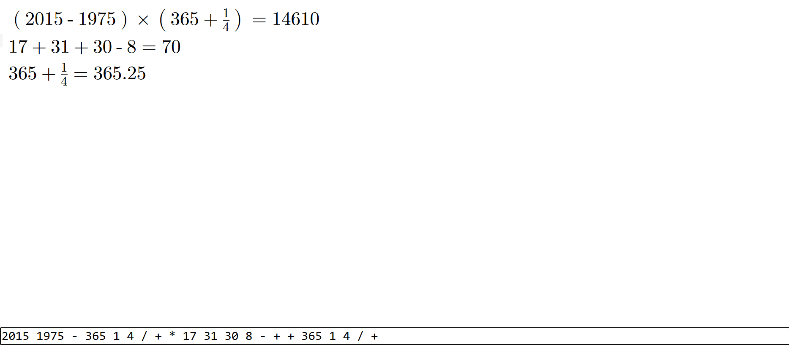

# RPN calculator

A RPN calculator that also formats your input as a pretty expression.

RPN is quite nice as a calculator: there is no hidden state, you can see every result as you type. The feedback loop is immediate and pleasant.

The expressions are displayed using [MathML](https://developer.mozilla.org/en-US/docs/Web/MathML), which gives you the ability to create nice formulas with very little code.

Inspired by [This prototype](http://canonical.org/~kragen/sw/dev3/rpn-edit).
